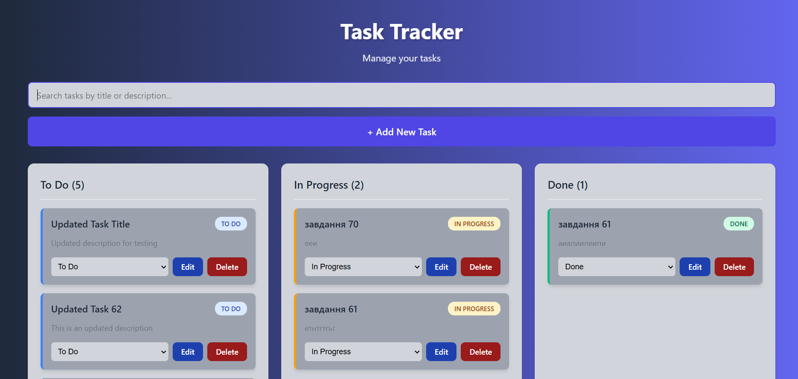

# Task Tracker

A simple web application for task management built with React and TypeScript.

## 📋 Description

Task Tracker allows you to create, edit, delete, and track the status of your tasks. The application works completely locally, storing data in the browser through localStorage.

## ✨ Features

- ✅ **Task List** - Display tasks organized by status (To Do / In Progress / Done)
- ➕ **Add Tasks** - Create new tasks with title, description, and status
- ✏️ **Edit Tasks** - Modify title, description, and status of existing tasks
- 🗑️ **Delete Tasks** - Delete tasks with confirmation
- 🔄 **Status Change** - Quick status change via dropdown
- 🔍 **Search** - Search tasks by title or description
- 💾 **Auto-save** - All data is automatically saved in localStorage

## 📸 Screenshot



*Task Tracker - Main interface with three status columns, search functionality, and modern gradient design*

The application features:
- **Three-column layout** for task organization (To Do, In Progress, Done)
- **Search bar** for quick task filtering
- **Modern gradient background** (dark blue to purple-blue)
- **Color-coded task cards** with status indicators
- **Responsive design** that works on all devices

## 🚀 Quick Start

### Requirements

- Node.js 18.0 or higher
- npm or yarn

### Installation

```bash
# Clone the repository
git clone <repository-url>
cd task_tracker

# Install dependencies
npm install

# Start development server
npm run dev
```

Open your browser at the URL shown in the terminal (usually `http://localhost:5173`).

### Commands

```bash
# Development
npm run dev

# Production build
npm run build

# Preview production build
npm run preview

# Code linting
npm run lint
```

## 📚 Documentation

- **[TASK_TRACKER_INSTRUCTIONS.md](./TASK_TRACKER_INSTRUCTIONS.md)** - Detailed instructions for the team
- **[AI_WORKFLOW_DOCUMENTATION.md](./AI_WORKFLOW_DOCUMENTATION.md)** - AI development process documentation
- **[DEVELOPMENT_PROCESS.md](./DEVELOPMENT_PROCESS.md)** - Development process description
- **[MCP_INTEGRATION.md](./MCP_INTEGRATION.md)** - MCP Server integration documentation
- **[MCP_SERVER_DOCUMENTATION.md](./MCP_SERVER_DOCUMENTATION.md)** - Complete MCP Server documentation

## 🛠️ Technologies

- **React 19** - UI library
- **TypeScript** - Typed JavaScript superset
- **Vite** - Build tool and development server
- **CSS** - Styling (no additional libraries)

## 📁 Project Structure

```
task_tracker/
├── src/
│   ├── components/          # React components
│   │   ├── TaskForm.tsx     # Add/Edit form
│   │   ├── TaskItem.tsx     # Individual task component
│   │   ├── TaskList.tsx     # Task list component
│   │   └── SearchBar.tsx   # Search component
│   ├── types/               # TypeScript types
│   │   └── Task.ts          # Task types
│   ├── utils/               # Utility functions
│   │   └── storage.ts       # localStorage utilities
│   ├── App.tsx              # Main component
│   ├── App.css              # App styles
│   ├── main.tsx             # Entry point
│   └── index.css            # Global styles
├── public/                  # Static files
├── mcp-server/             # MCP Server for automation
├── package.json             # Project dependencies
└── README.md                # Main documentation
```

## 💾 Data Storage

All tasks are stored locally in the browser through **localStorage**. Data is not sent to the server and is only available on your device.

## 🎨 Design Features

- Modern gradient background
- Color-coded status indicators
- Responsive design for mobile devices
- Smooth animations and hover effects
- Tasks organized in three columns by status

## 📝 License

This project was created as part of a test assignment.

## 🤝 Contributing

If you want to improve the project:
1. Fork the repository
2. Create a feature branch (`git checkout -b feature/AmazingFeature`)
3. Commit your changes (`git commit -m 'Add some AmazingFeature'`)
4. Push to the branch (`git push origin feature/AmazingFeature`)
5. Open a Pull Request

## 📞 Support

If you have questions or issues, please:
- Check the [instructions](./TASK_TRACKER_INSTRUCTIONS.md)
- Create an Issue in the repository
- Contact the development team

---

**Enjoy using Task Tracker!** 🚀
